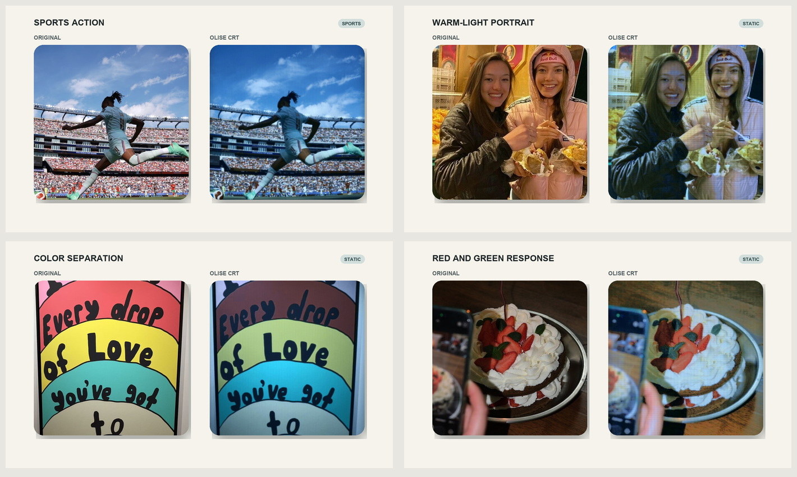
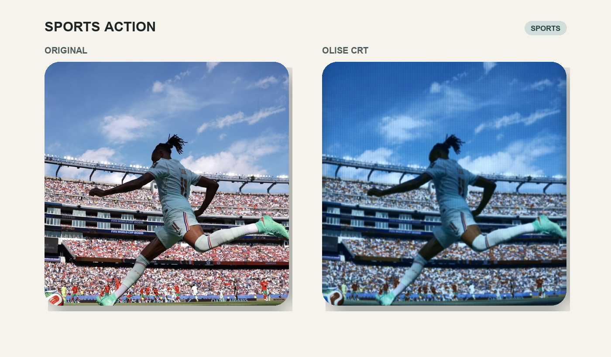
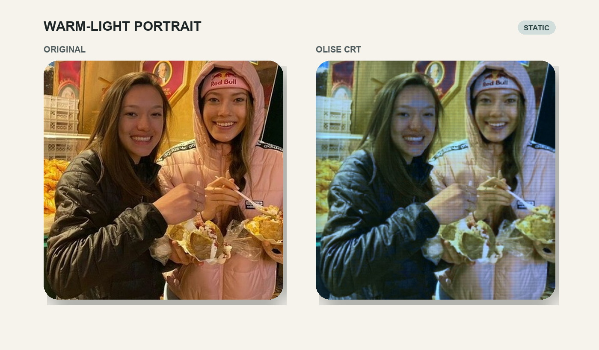
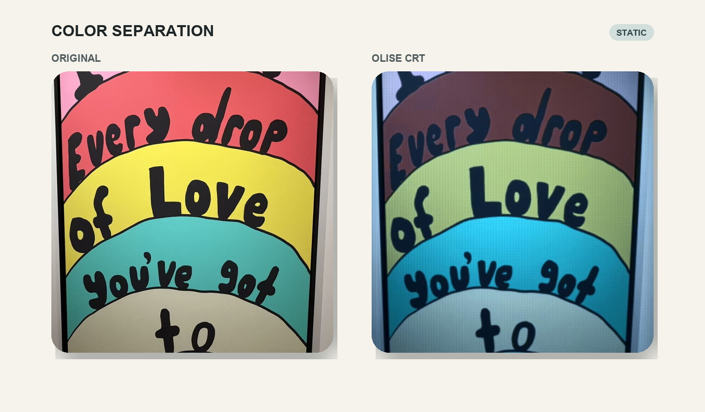
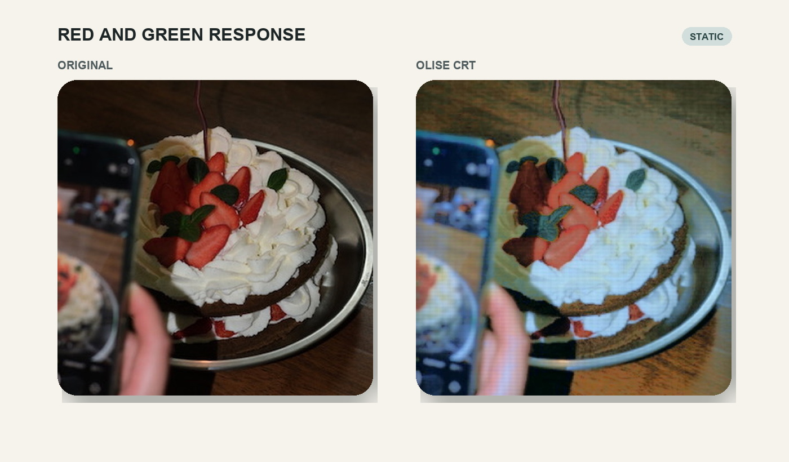

# Olise CRT Photo Skill

一套面向不同照片场景自适应的冷青 CRT / VHS / 摄录机风格化 Skill。核心不是单纯叠蓝色 LUT，而是模拟“镜头重新拍摄旧电视屏幕”的完整视觉链路。

## 场景处理总结

| 场景 | 处理方式 | 关键保护 |
|---|---|---|
| 静态人像、合照、自拍、物品 | 最轻鱼眼，不加拖影 | 保留人物辨识度，肤色只偏冷、不变紫 |
| 低清截图、转载图 | 降低像素化混合与高斯模糊 | UI 文字和主体轮廓不被糊掉 |
| 行走、手势、轻动态抓拍 | 中等边缘鱼眼 | 保留动态感但不制造马赛克拖影 |
| 足球、篮球、跳跃等强动态 | 更明显但克制的边缘鱼眼 | 主体仍清晰，不合成运动残影 |
| 暖黄室内、钨丝灯环境 | 先做自适应白平衡，再施加冷青偏色 | 避免暖底与蓝色相加后变脏 |
| 紫粉 LED、直播美颜光 | 洋红收敛为冷灰 | 避免鼻尖、脸颊出现紫色斑块 |
| 红绿黄青同时出现 | 按色相族选择性映射 | 红压暗、绿抽灰、黄变脏、青蓝存活 |

所有场景都会得到双层扫描网格、分辨率自适应柔化、轻微 CRT 黑边、曝光自适应光晕和统一的冷青屏幕基调。处理器保留原始尺寸与构图，不自动裁成 4:3。

## 对比



### 强动态球场

强动态仅增加边缘鱼眼，人物、球和看台仍可辨认。



### 暖光人像

先校正暖光污染，再进入冷青环境，同时保护肤色。



### 红、黄、青色块

红色变暗变密，黄色失去数码荧光感，青色成为主要存活色。



### 红色草莓与绿色叶片

红色保留身份但更暗，绿色明显抽灰，而不是整张图统一降饱和。



## 使用

Skill 位于 [`apply-olise-crt`](apply-olise-crt/)。

```bash
python3 -m pip install -r apply-olise-crt/scripts/requirements.txt
python3 apply-olise-crt/scripts/apply_olise_crt.py photo.jpg -o output
```

批量处理：

```bash
python3 apply-olise-crt/scripts/apply_olise_crt.py a.jpg b.png -o output
```

自动识别之外，也可手动指定场景尺度：

```bash
python3 apply-olise-crt/scripts/apply_olise_crt.py photo.jpg -o output --motion static
python3 apply-olise-crt/scripts/apply_olise_crt.py photo.jpg -o output --motion mild
python3 apply-olise-crt/scripts/apply_olise_crt.py photo.jpg -o output --motion sports
```

在 Codex 中可直接调用：

```text
我想制作 Olise/奥利塞同款失真照片。
```
